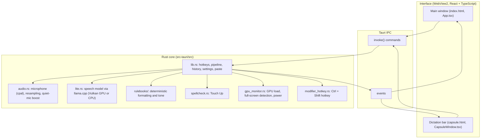

# Ivy architecture

Ivy is an offline dictation app for Windows built with **Tauri v2** (Rust) and **React 19 / TypeScript**.
The interface runs in Microsoft WebView2 and only shows things and sends commands. Everything else
(microphone, the speech model, formatting, pasting into other apps) runs in the Rust core.

## How a dictation flows

1. The hotkey starts recording (`audio.rs`). Audio stays in memory.
2. On release, the silence gate (`rulebooks/hallucinations.rs`, stage A) drops recordings with no voice.
3. `lite.rs` runs Ivy's speech model (Qwen3-ASR-1.7B fine-tuned for dictation, GGUF, through llama.cpp's
   mtmd audio support). It hears the speech and writes clean text, with self-corrections applied, in one pass.
4. The rulebooks format that text: spoken commands, numbers, tech terms, names, the active tone, typography.
5. The personal dictionary fixes spellings of names and jargon. Then Snippets replace trigger phrases with
   their saved text.
6. `lib.rs` pastes through the clipboard, but only if the window you dictated into still has focus. The
   clipboard is marked so Windows leaves it out of clipboard history, and your previous clipboard is restored.
7. The audio buffer is overwritten with zeros. The recording and transcript are saved in History and
   deleted after 24 hours.

## Files

### Rust core (`src-tauri/`)

| Path | Purpose |
|---|---|
| `src/main.rs` | Entry point. Sets one WebView2 flag (autoplay for the launch sound) and starts `app_lib::run()`. |
| `src/lib.rs` | App setup, tray, hotkeys, the dictation pipeline, IPC commands, settings, History, the paste. |
| `src/lite.rs` | Loads the speech model and transcribes. Picks GPU (Vulkan) or CPU. |
| `src/audio.rs` | Microphone capture, resampling to 16 kHz, quiet-microphone boost. |
| `src/rulebooks/` | The formatting books (see [RULEBOOKS.md](RULEBOOKS.md)). |
| `src/spellcheck.rs` | Touch Up: fixes misspelled words only, never rewrites. |
| `src/gpu_monitor.rs` | Watches GPU load and full-screen apps, so Ivy steps aside for games; battery detection. |
| `src/modifier_hotkey.rs` | The Ctrl + Shift hotkey, which Windows can't register as a normal hotkey. |
| `tauri.conf.json` | Windows, Content Security Policy (local content only), installer settings. |
| `capabilities/default.json` | Which Tauri permissions the interface gets (window basics only). |
| `installer/hooks.nsh` | Installer steps: copy the model from next to the setup file, ask before deleting data on uninstall. |
| `vendor/llama-cpp-sys-2/` | Vendored llama.cpp bindings with one patch (search for "IVY PATCH"). |
| `data/en-80k.txt` | Word list for Touch Up (MIT). |
| `tests/fixtures/` | Synthesized test audio (no real voices). |

### Interface (`src/`)

| Path | Purpose |
|---|---|
| `App.tsx` | Main window: views, window controls, settings. |
| `CapsuleWindow.tsx`, `components/FloatingCapsule.tsx` | The dictation bar. |
| `components/HomeView.tsx` | Stats and activity. |
| `components/HistoryView.tsx` | Recent dictations: copy, retry, Touch Up, download the recording, delete. |
| `components/DictionaryView.tsx` | Personal dictionary and Snippets. |
| `components/ToneView.tsx` | Tones and per-app tones. |
| `components/SettingsView.tsx` | Hotkey, microphone, GPU/CPU, startup. |
| `components/FirstRunView.tsx` | First-run setup wizard with a microphone test. |

### Build and release

| Path | Purpose |
|---|---|
| `scripts/download-models.mjs` | For source builds: downloads the model from the GitHub release and checks its SHA-256. |
| `scripts/package-installer.mjs` | Builds the installer and the release folder (setup + model files + `SHA256SUMS.txt`). |
| `.github/workflows/` | CodeQL, Gitleaks, cargo/npm audit, Dependency Review, OpenSSF Scorecard, a Windows build check. |

## IPC commands

The interface calls these with `invoke()`. Commands that take a History `id` check it against a strict
allow-list (letters, digits, `-`, `_`) and confirm any file path stays inside Ivy's own audio folder.

| Command | What it does |
|---|---|
| `get_settings`, `save_settings` | Read and save settings (validated before saving). |
| `get_history`, `delete_history_entry`, `clear_all_history` | History. |
| `retry_transcription`, `touch_up_transcript`, `extract_audio` | Act on one History entry. |
| `repaste_transcript` | Paste a History entry again (rate-limited, length-capped). |
| `get_user_stats` | Word counts and streaks (numbers only). |
| `start_manual_dictation`, `stop_manual_dictation`, `cancel_dictation` | Dictation from the interface. |
| `pause_ivy`, `resume_ivy`, `get_pause` | Pause Ivy. |
| `get_active_context` | The app you're dictating into (for per-app tones). |
| `list_audio_input_devices` | Microphones. |
| `get_hardware_status`, `apply_hardware_mode` | GPU/CPU status and switching. |
| `minimize_main`, `toggle_maximize_main`, `close_main`, `show_main_window`, `hide_capsule_window`, `set_wizard_active` | Windows. |

## Security and privacy

See [SECURITY.md](SECURITY.md) for the full model. In short: no network calls, a strict local-only Content
Security Policy, audio wiped from memory after each dictation, History deleted after 24 hours, and pastes
only into the window you dictated into.
