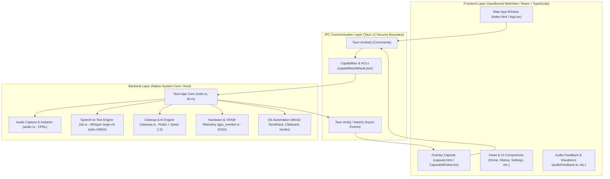

# IVY Architecture & Codebase Map

> **System Overview:** IVY is a standalone, 100% offline, zero-cloud speech-to-text dictation application built on **Tauri v2**, **Rust**, and **React 19 / TypeScript**.
>
> It follows the **Tauri v2 Principle of Least Privilege**: sandboxing the user-facing web interface in Microsoft WebView2 while executing low-level audio capture, hardware acceleration, neural inference, and OS keystroke injection inside a memory-safe Rust native core.

---

## 1. Architectural Model & Component Interaction

---

## 2. Comprehensive Codebase Organization

### A. Frontend (Presentation & Client Logic)

The frontend is packaged using Vite and runs in Microsoft WebView2 without direct filesystem or network access.

| Path | Category | Purpose |
| :--- | :--- | :--- |
| `index.html` | Window Host | HTML entry point for the main dashboard window. |
| `capsule.html` | Window Host | Dedicated transparent HTML entry point for the floating liquid-glass capsule overlay. |
| `src/main.tsx` | App Bootstrapper | Initializes the React root, global error boundary, and launches `App.tsx`. |
| `src/capsule-main.tsx` | Overlay Bootstrapper | Dedicated, isolated entry point for the system-wide floating overlay window. |
| `src/App.tsx` | Main Application | Primary UI container, view routing, window controls (minimize/maximize/close), and settings loading. |
| `src/CapsuleWindow.tsx` | Overlay Window | Real-time state machine for recording, transcribing, and paste confirmation. |
| `src/components/HomeView.tsx` | View | Dashboard showing words dictated, WPM, streaks, dictation mode switcher, and activity. |
| `src/components/HistoryView.tsx` | View | Transcription session history, audio playback, AI summarization, retry, and deletion. |
| `src/components/SettingsView.tsx` | View | Hardware mode selector (GPU/CPU), hotkey configuration, mic selector, and tone matrix. |
| `src/components/DictionaryView.tsx` | View | Custom vocabulary replacements (exact match and fuzzy sound-alike tokens). |
| `src/components/ToneView.tsx` | View | Manages tone profiles (Casual, Standard, Professional) and per-app tone assignments. |
| `src/components/FirstRunView.tsx` | Onboarding | 7-stage interactive onboarding wizard for first-time setup and hotkey training. |
| `src/components/StageIndicator.tsx` | UI Component | Progress track indicator for the onboarding flow. |
| `src/components/FloatingCapsule.tsx` | Overlay UI | The floating pill showing recording waves, transcribing progress, and paste status. |
| `src/components/Sidebar.tsx` | Navigation | Sidebar navigation between Home, History, Dictionary, Tone, and Settings views. |
| `src/components/HotkeyBadge.tsx` | UI Component | Visual keyboard keycaps for hotkeys with pressed-state animations. |
| `src/components/SoundwaveVisualizer.tsx` | Visualizer | Reactive audio waveform animation while recording audio. |
| `src/components/IvyLaunchIntro.tsx` | Intro Effect | Cinematic splash/launch logo animation on initial launch. |
| `src/components/IvyLogo.tsx` | Asset Component | Vector SVG logo mark. |
| `src/components/IvyWordmark.tsx` | Asset Component | Vector SVG brand wordmark. |
| `src/components/GlassParticles.tsx` | Canvas Effect | Ambient floating glass particle effect for the main window background. |
| `src/components/AtmosphericDust.tsx` | Canvas Effect | Ambient dust mote simulation for visual depth. |
| `src/services/audioFeedback.ts` | Audio Service | Synthesizes auditory feedback sounds for recording start, stop, success, and error. |
| `src/utils/audio.ts` | Audio Utility | Web Audio API sound synthesizer and tone generator. |
| `src/types.ts` | Type Definitions | TypeScript interfaces matching backend models (`SettingsConfig`, `DictationSession`, `UserStats`). |
| `src/defaults.ts` | Default State | Initial fallback data and default user settings. |
| `src/stats.ts` | Analytics Helper | Calculations for streak tracking, word counts, and WPM rates. |
| `src/index.css` | Styling | Global Tailwind styles, custom animations, and glassmorphism styling. |

---

### B. Backend (Rust Native Engine & AI Pipeline)

The backend resides in `src-tauri/` and executes all OS integrations, audio capture, and local neural network execution.

| Path | Subsystem | Purpose |
| :--- | :--- | :--- |
| `src-tauri/src/main.rs` | Windows Entry Point | Configures WebView2 runtime flags (e.g. `--autoplay-policy=no-user-gesture-required`) and starts `app_lib::run()`. |
| `src-tauri/src/lib.rs` | Core & IPC Controller | Tauri v2 setup, system tray, global shortcut listener, IPC command registration, and Win32 clipboard injection. |
| `src-tauri/src/audio.rs` | Audio Pipeline | Dedicated thread wrapper for `cpal` to isolate COM state, DAGC gain normalization, and RAM sample zeroization. |
| `src-tauri/src/stt.rs` | Speech-to-Text | Whisper large-v3-turbo int8 ONNX inference via `ort` (fixed 30s encoder window), DirectML GPU acceleration with automatic CPU fallback, greedy decoding with dictionary hotword biasing. |
| `src-tauri/src/cleanup.rs` | Cleanup & LLM | 50+ deterministic rules (<0.5ms) + local Qwen 2.5 3B via `llama-cpp-2` (Vulkan): live cleanup in GPU Accuracy mode behind a faithfulness guard, plus on-demand Touch Up & Summarization. |
| `src-tauri/src/gpu_monitor.rs` | Hardware Telemetry | DXGI video adapter telemetry, VRAM usage tracking, idle eviction state, and Windows power detection. |
| `src-tauri/Cargo.toml` | Dependencies | Cargo manifest declaring native dependencies (`tauri`, `ort`, `llama-cpp-2`, `cpal`, `windows`, `serde`). |
| `src-tauri/tauri.conf.json` | Tauri Configuration | Window definitions (`main` and `capsule`), bundle identifiers, and security boundaries. |
| `src-tauri/capabilities/default.json` | Security Capabilities | Tauri v2 security ACL defining allowed commands for frontend windows. |
| `src-tauri/.cargo/config.toml` | Compiler Flags | MSVC compiler flags (`/FS`), CMake generator (`Ninja`) for compiling llama.cpp bindings, and the Cargo `target-dir`. |
| `src-tauri/models/` | Neural Models | Offline model weights: Whisper ONNX (`whisper/encoder_model_int8.onnx`, `decoder_model_merged_int8.onnx`, `tokenizer.json`) and the Qwen 2.5 3B GGUF. |
| `src-tauri/installer/` | Packaging Scripts | NSIS installer script (`wrapper.nsi`) and hook definitions (`hooks.nsh`) for single-executable distribution. |
| `src-tauri/icons/` | Application Icons | Windows `.ico`, macOS `.icns`, Android/iOS mipmaps, and PNG icons. |
| `src-tauri/tests/fixtures/` | Test Samples | Audio test samples (`sample.wav`, `real_speech_sample.wav`) and fixture generation script (`generate_sample.ps1`). |

---

### C. Build Tools & DevOps (Fullstack Glue)

| Path | Purpose |
| :--- | :--- |
| `package.json` | Project scripts (`npm run tauri dev`, `npm run build`, `npm run setup-models`, `npm run package-installer`) and dependencies. |
| `vite.config.ts` | Multi-page Vite configuration bundling both `index.html` (Main UI) and `capsule.html` (Overlay UI). |
| `tsconfig.json` | TypeScript compiler options. |
| `scripts/download-models.mjs` | Node.js script fetching the Whisper ONNX and Qwen 2.5 3B GGUF models from Hugging Face. |
| `scripts/package-installer.mjs` | Builds the NSIS installer, then wraps it and the Qwen GGUF into one downloadable exe. |
| `scripts/generate-checksums.ps1` | PowerShell script generating release file SHA-256 verification hashes. |
| `.github/workflows/` | GitHub Actions CI/CD workflows for CodeQL static analysis, secret scanning, dependency reviews, and automated builds. |
| `SECURITY.md` | Threat model, memory zeroization documentation, and vulnerability reporting guidelines. |
| `IVY.md` & `README.md` | Core engineering documentation, session memory, and quick start guides. |

---

## 3. Inter-Process Communication (IPC) Interface

### Native Commands (`invoke`)
The frontend calls these commands via `@tauri-apps/api/core`:

| Command | Arguments | Return Type | Description |
| :--- | :--- | :--- | :--- |
| `start_manual_dictation` | None | `void` | Starts microphone recording from the onboarding or UI trigger. |
| `stop_manual_dictation` | None | `void` | Stops recording and begins transcription pipeline. |
| `cancel_dictation` | None | `void` | Aborts current recording/transcription and purges buffers. |
| `list_audio_input_devices`| None | `Vec<String>` | Enumerates available system microphones via CPAL. |
| `get_settings` | None | `SettingsConfig` | Loads user configuration from `settings.json`. |
| `save_settings` | `settings: SettingsConfig` | `Result<(), String>` | Persists updated user configuration to disk. |
| `get_history` | None | `Vec<DictationSession>` | Fetches local transcription history list. |
| `delete_history_entry` | `id: String` | `Result<(), String>` | Deletes specific transcript and corresponding `.wav` audio. |
| `clear_all_history` | None | `Result<(), String>` | Clears all stored transcripts and audio files. |
| `get_user_stats` | None | `UserStats` | Loads anonymized productivity stats (`stats.json`). |
| `retry_transcription` | `id: String` | `Result<RetryResult, String>` | Re-runs STT and cleanup on a previous audio session. |
| `summarize_transcript` | `id: String` | `Result<String, String>` | Generates an AI summary via local Qwen 2.5 3B. |
| `touch_up_transcript` | `id: String` | `Result<String, String>` | Runs AI proofread & style cleanup via local Qwen 2.5. |
| `extract_audio` | `id: String` | `Result<String, String>` | Exports session audio to user's Downloads directory. |
| `repaste_transcript` | `text: String` | `Result<bool, String>` | Injects transcript text into target window via simulated paste. |
| `get_active_context` | None | `ActiveContext` | Detects currently focused foreground application window. |
| `get_hardware_status` | None | `HardwareStatusDto` | Returns GPU VRAM usage and adapter telemetry. |
| `apply_hardware_mode` | None | `void` | Switches between GPU DirectML acceleration and CPU execution. |
| `trigger_undo_paste` | None | `void` | Sends synthetic `Ctrl+Z` to reverse last paste operation. |
| `minimize_main` | None | `void` | Minimizes main app window. |
| `toggle_maximize_main` | None | `void` | Toggles maximized state of main window. |
| `close_main` | None | `void` | Minimizes main window to system tray. |
| `show_main_window` | None | `void` | Restores and brings main window to front. |
| `hide_capsule_window` | None | `void` | Hides the floating capsule overlay window. |

---

## 4. Security & Privacy Model

1. **Zero Cloud Leakage:** All speech recognition (Whisper ONNX) and AI cleanup/summarization (Qwen 2.5 3B GGUF) run entirely in-process on the local machine.
2. **Audio RAM Zeroization:** Raw PCM audio sample buffers in memory (`Vec<f32>`) are actively overwritten with zeros (`fill(0.0)`) upon completion or cancellation to prevent residual audio in unallocated memory.
3. **Daily Auto-Purge:** Audio recordings (`.wav`) and session text transcripts are automatically deleted after 24 hours.
4. **Strict IPC Validation:** Native Tauri IPC handlers validate all session identifiers to prevent directory traversal attacks.
