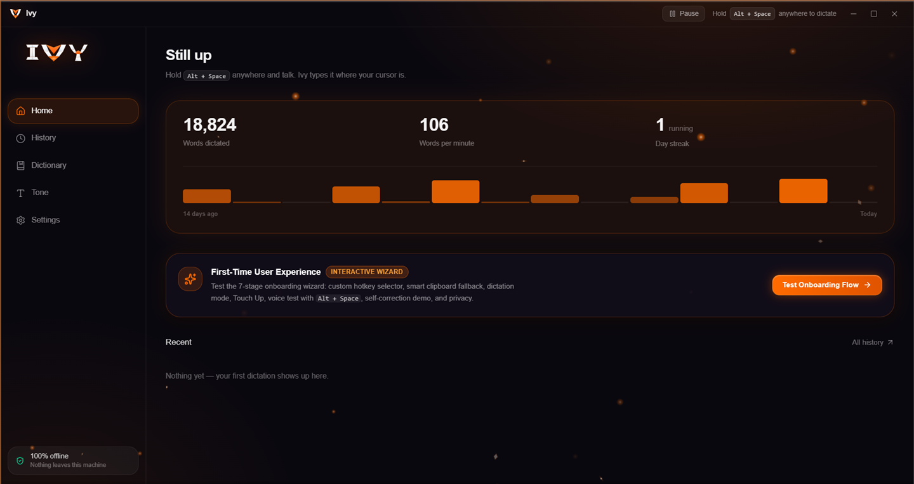
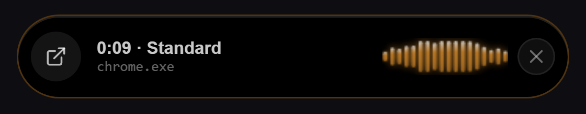

# Ivy

**Talk, and clean text appears wherever your cursor is. Fully offline and free, with all its source code public, for Windows.**

Hold a key, speak naturally, let go. Ivy turns your speech into clean, ready-to-send text and pastes it
into whatever you were typing in: email, chat, documents, code editors, browsers, anything.

Everything happens on your own computer. No account, no subscription, no internet connection, no
cloud. Your voice never leaves your PC.

**[Download Ivy for Windows](https://github.com/raj-7676/IVY-/releases/latest)**



While you talk, a small bar shows the time, the tone in use and the app you're typing into:



---

## What makes Ivy different

**It writes what you *meant*, not just what you said.**
People change their minds mid-sentence. Most dictation apps type every word, and you fix it by
hand. Ivy understands self-corrections and writes the final version. The kind of thing it handles:

| You say | Ivy types |
|---|---|
| "Let's meet on Tuesday, sorry, I mean Thursday." | Let's meet on Thursday. |
| "Book a table for four, actually make it six." | Book a table for six. |
| "Tell Sam the call is at 3, no wait, 4 PM." | Tell Sam the call is at 4 PM. |
| "Um, so, I I think we should, uh, ship it." | I think we should ship it. |

It also drops fillers (um, uh), removes stutters and repeated words, adds punctuation and capital
letters, and writes numbers, money, times and dates the way you'd type them.

**One small model does all of it.** Ivy's speech model hears and cleans up in a single pass. There's
no second AI rewriting your text afterwards, so it stays fast and keeps your words.

**Truly offline.** Ivy goes online only once: on first start it downloads its speech model from this
repository's release (skip even that by [installing offline](#option-2-download-the-setup-file)). After that
it never phones home, not even for updates.

**Built for real voices.** The model was trained on many hours of real people speaking (noisy rooms,
cheap microphones, many accents) with human-written transcripts, plus thousands of dictation
paragraphs full of corrections.

---

## Features

- **Hold to talk:** hold **Alt + Space** (or **Ctrl + Shift**, your choice in Settings), speak, release.
- **Hands-free:** double-tap the key to start recording, tap once more to stop. Good for long dictations (up to 5 minutes; a "10 s left" badge warns you).
- **Three tones:**
  - **Casual:** texting style. Your words as spoken, no full stops, one sentence per line.
  - **Standard:** clean, normal writing. Slang is written out.
  - **Professional:** formal. No contractions, slang, chat words or exclamation marks.
- **Per-app tones:** add apps to a tone (for example Slack to Casual and Outlook to Professional), and Ivy switches automatically.
- **Touch Up:** after a paste, one click fixes spelling mistakes. It only corrects misspelled words and never rewrites your sentences.
- **Personal dictionary:** teach Ivy names, brands and jargon so it spells them your way.
- **Snippets:** save a trigger phrase and the text it stands for (an address, a signature, a template). Say the trigger anywhere in a sentence and Ivy types the saved text in its place.
- **Smart number formatting:** "500 rupees" becomes ₹500. Big round amounts are written the readable way, for example "18 lakhs", "2.5 crores" or "2 million".
- **Quick key:** **Alt + V** pastes your last dictation again. To take a paste back out, use the app's own **Ctrl + Z**.
- **History:** your recent dictations, with their audio, are kept on your PC so you can copy them, retry them or download the recording.
- **Pause:** turn Ivy off for an hour (or up to 24 hours) from the title bar or the tray icon.
- **GPU or CPU:** runs on any graphics card (NVIDIA, AMD or Intel) or on the processor alone. On battery it switches to CPU to save power.
- **Plays nice with games:** when a game or full-screen video is in front, Ivy goes to sleep, frees the graphics card and leaves your keys to the game. If another program is working the graphics card hard, Ivy moves to the CPU until it calms down.
- **Quiet microphone friendly:** Ivy boosts soft recordings automatically.

## Privacy

- **No internet, ever.** Speech recognition and cleanup run entirely on your PC.
- **Automatic clean-up:** recordings and transcripts are deleted after 24 hours. **Clear all** in History deletes them immediately.
- **Not saved in your clipboard history:** Ivy's pastes are kept out of Windows' clipboard history (Win + V) and clipboard cloud sync.
- **Memory wiped:** audio in memory is overwritten with zeros once your dictation is done.
- **Your stats stay, your words don't:** streaks and word counts are stored as plain numbers, separate from your transcripts.
- **Uninstall asks first:** the uninstaller offers to delete all Ivy data from your PC.

See [SECURITY.md](SECURITY.md) for the security details.

---

## Installing

Pick one of the two ways. Both install the same Ivy.

### Option 1: one command (easiest)

Open **PowerShell** (press Start, type `PowerShell`, press Enter), paste this and press Enter:

```powershell
irm https://raw.githubusercontent.com/raj-7676/IVY-/main/install.ps1 | iex
```

It downloads the latest setup file from this page's releases, checks it against its published checksum,
installs Ivy and starts it, the same as Option 2. You can [read the script](install.ps1) first; it sends
nothing anywhere.

### Option 2: download the setup file

1. From the **[latest release](https://github.com/raj-7676/IVY-/releases/latest)**, download `Ivy_<version>_x64-setup.exe` and run it.
2. Ivy opens and downloads its speech model (one time only, about 2.5 GB), showing size, speed and time left.
   If your internet drops, Ivy carries on by itself; if it gives up, press **Retry**. Nothing already
   downloaded is lost, even if you close Ivy.
3. When the download is done, Ivy's short setup wizard opens by itself: pick your key, choose GPU
   (graphics card) or CPU, and test your microphone. Then hold **Alt + Space** and talk.

**Installing offline?** Also download `ivy-lite-Q8_0.gguf` (1.8 GB) and `mmproj-ivy-lite-f16.gguf` (0.6 GB)
into the **same folder** as the setup file before running it. Setup copies them in and Ivy never goes online.
The model is one model stored as two files, because GitHub allows at most 2 GB per file.
After installing, you can delete the downloaded files.

**"Windows protected your PC"?** Ivy is new and not code-signed yet, so Windows SmartScreen may warn
you. Click **More info**, then **Run anyway**. All the code is here, so anyone can check what it does.

### System requirements

- Windows 10 or 11, 64-bit (tested on Windows 11). Setup takes care of the rest:
  - **Microsoft Edge WebView2** (draws Ivy's window): Windows 11 already has it; on an older Windows 10 setup downloads it once.
  - **Microsoft Visual C++ runtime** (needed by the speech engine): bundled in setup and installed only if your PC doesn't have it yet. Windows then asks for permission once.
  - **The speech model**: downloaded by Ivy on first start, or taken by setup from next to the setup file.
- About 3 GB of free disk space (5 GB while installing)
- A microphone
- A graphics card driver (NVIDIA, AMD or Intel; every current driver includes Vulkan). With a supported GPU Ivy is much faster; it also runs on the CPU alone.

### How fast is it?

Measured on a laptop with an RTX 4060:

| Length of speech | GPU | CPU only |
|---|---|---|
| 5 seconds | about 0.3 s | about 2-3 s |
| 30 seconds | about 0.5 s | about 5-10 s |
| 1 minute | about 2 s | about 10-20 s |

---

## Building from source

**Prerequisites:**

- [Rust](https://rustup.rs/) (stable) and the [Tauri v2 prerequisites for Windows](https://v2.tauri.app/start/prerequisites/) (MSVC Build Tools, WebView2)
- [Node.js](https://nodejs.org/) 18+
- CMake, Ninja, and LLVM (for `libclang.dll`) on `PATH`, needed to build the `llama.cpp` bindings. Visual Studio 2022 Build Tools usually ship CMake/Ninja under `...\Common7\IDE\CommonExtensions\Microsoft\CMake\`; LLVM installs with `winget install LLVM.LLVM`.
- The [Vulkan SDK](https://vulkan.lunarg.com/) (sets `VULKAN_SDK`); `llama.cpp` is built with its Vulkan GPU backend.
- Windows' 260-character path limit can break the nested Vulkan shader build. Point Cargo at a short folder first:
  `$env:CARGO_TARGET_DIR = "C:\ivytgt"` (PowerShell) or `set CARGO_TARGET_DIR=C:\ivytgt` (cmd).

```bash
npm install
npm run setup-models   # downloads Ivy's model (~2.4 GB) from the GitHub release, once
npm run tauri dev      # real hotkey, real transcription, dev build
```

To build a release:

```bash
npx tauri build --no-bundle   # just the app exe, in Cargo's target folder
npm run package-installer     # the full release folder: setup exe + the two model files
```

Always build through `npm run tauri dev` / `npx tauri build`. A bare `cargo build` skips Tauri's
pipeline, and the exe will look for the dev server instead of the bundled interface.

Tests: `cargo test --lib -- --test-threads=1` inside `src-tauri`.

More detail: [ARCHITECTURE.md](ARCHITECTURE.md) (how it fits together), [RULEBOOKS.md](RULEBOOKS.md)
(the formatting and tone rules), [IVY.md](IVY.md) (full engineering notes).

---

## License

Ivy is **free for everyone, including at work**, and all of its source code is public. You may use it,
change it and share it. You may **not sell it**: no charging for Ivy, for a changed copy of Ivy, or for a
paid product or service built mainly on it. Legally this is the MIT License with the Commons Clause
condition; see [LICENSE](LICENSE).

The speech model is Ivy's fine-tune of Qwen3-ASR-1.7B (Apache 2.0). The fine-tune follows the same rule as
the app: free to use, not for sale ([LICENSES/IVY-MODEL-LICENSE.txt](LICENSES/IVY-MODEL-LICENSE.txt)).
Credits for the model, libraries and data are in [THIRD_PARTY_NOTICES.md](THIRD_PARTY_NOTICES.md).
